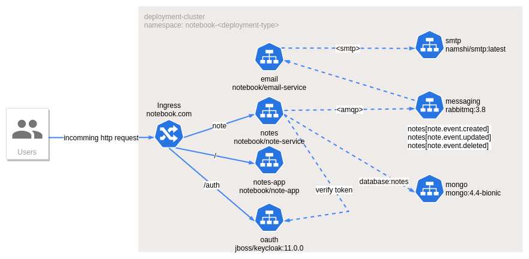
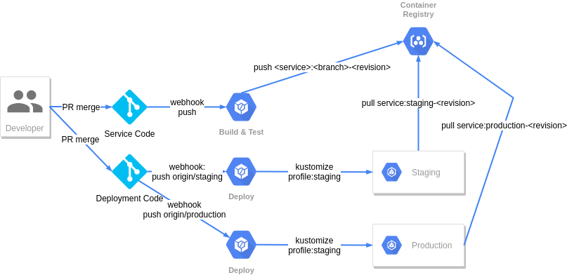

# notebook-deployment

This project manages the deployment of the notebook application to a kubernetes cluster.  

## Application Design



The application has the following key points:

1. Identity Authoriation Management (IAM) using an OAuth 2.0 service, in this case keycloak.
1. An Rest API implmented using Spring Boot, Security, WebFlux.
1. A MongoDB store to persist user notes.
1. An AMQP compatible messaging service, in this case RabbitMQ.
   - An exchange `notes` with bindings to the following queues is used:
     - [`notes.event.created`] -> [`notes-event-created`]
     - [`notes.event.updated`] -> [`notes-event-updated`]
     - [`notes.event.deleted`] -> [`notes-event-deleted`]
1. A backend email service to listen and notify users of updates.
1. A frontend SPWA implemented using Reactjs

Please note, the front end is a work in progress and currently only provides authentication and displays the users JWT token.

The service code is located in the following repositories:
- [notebook/note-service](https://github.com/fbyrne/notebook-note-service)
- [notebook/email-service](https://github.com/fbyrne/notebook-email-service)
- [notebook/note-app](https://github.com/fbyrne/notebook-notes-app)

## Deployment Design

The deployment is designed to use [kustomize](https://kubernetes-sigs.github.io/kustomize/) to deploy multiple configuration from the same base kubernetes resource manifests.

## Installing Required Tools

### Installing [kustomize](https://kubernetes-sigs.github.io/kustomize/)

Installation instructions can be found @ https://kubernetes-sigs.github.io/kustomize/installation.

```shell script
curl -s "https://raw.githubusercontent.com/\
kubernetes-sigs/kustomize/master/hack/install_kustomize.sh"  | bash
sudo install kustomize /usr/local/bin
```

### Installing [skaffold](https://skaffold.dev)

Installation instructions can be found @ https://skaffold.dev/docs/install/.

```shell script
curl -Lo skaffold https://storage.googleapis.com/skaffold/releases/latest/skaffold-linux-amd64 && \
sudo install skaffold /usr/local/bin/
```

## Gettings Started with minikube

Here are the steps to start the service:

1. Clone the git repositories
   ```shell script
   $ mkdir notebook; cd notebook
   $ git clone https://github.com/fbyrne/notebook-note-service.git
   $ git clone https://github.com/fbyrne/notebook-email-service.git
   $ git clone https://github.com/fbyrne/notebook-notes-app.git
   $ git clone https://github.com/fbyrne/notebook-deployment.git
   ```
1. Start minikube
   ```shell script
   $ minikube start
   $ minikube addons enable ingress
   $ minikube addons enable dashboard
   $ sudo minikube tunnel --cleanup
   ```
1. Open a new terminal and point docker to minikube
   ```shell script
   $ eval $(minikube docker-env)
   ```
1. Patch the kubernetes nginx ingress controller config to resolve a problem with keycloak running behind the ingress.
   ```shell script
   $ kubectl patch configmap/nginx-load-balancer-conf \
       -n kube-system \
       --type merge \
       -p '{"proxy-buffer-size": "16k"}'
    ``` 
1. Build all service code
   ```shell script
   $ (cd notebook-note-service && skaffold build)
   $ (cd notebook-email-service && skaffold build)
   $ (cd notebook-notes-app && skaffold build)
   ```
1. Identify the minikube ingress ip
   ```shell script
   $ export NOTEBOOK_INGRESS_DNS="notebook-$(minikube ip | sed 's/\./-/g').nip.io"
   ```
1. At this time, I could not find a way to update the ingress host references via a variable.  So this needs to be replaced with the value of environment variable NOTEBOOK_INGRESS_DNS in:
   - base/notes-application.properties
   - overlays/dev/ingress-sethost-patch.yaml
   - overlays/dev/notes-app-keycloak.json
1. Deploy the services on the cluster.  
   ```shell script
   $ (cd notebook-deployment && skaffold run)
   ```
   Note if the images fail to pull, repeat point the docker to minikube and rebuild the service code.
1. Open a browser to `http://$NOTEBOOK_INGRESS_DNS/` and you should be met with a login/register screen.
1. Register as a user
1. A JWT token is displayed in the text box on screen.
1. Once a user has been created you can login from the command-line using
   ```shell script
   $ JWT=$(curl -s "http://$NOTEBOOK_INGRESS_DNS/auth/realms/notebook/protocol/openid-connect/token" \
              -d "client_id=notebook-frontend" \
              -d "username=<user>" -d "password=<plain-password>" \
              -d "grant_type=password"  | jq -r .access_token)
   ```
1. Use this JWT token in POSTMAN or cURL to issue requests to the API
   ```shell script
   $ JWT='ABC.DEF.XYZ'
   $ curl -i --request POST \
      --location "http://$NOTEBOOK_INGRESS_DNS/note" \
      --header 'Authorization: Bearer '"$JWT"'' \
      --header 'Content-Type: application/json' \
      --data-raw '{"id":"{noteId}","version":1,"content":"My first note"}'
   ```
1. The result should be a 201 Created. The location header returns the path to the created resource.
1. If you get a 401 Unauthorized, check the response `WWW-Authenticate` header for details.
   - Usually the token has expired and needs to be refreshed.
1. Note can be retrieved using the following curl command:
   ```shell script
   $ curl -s --request GET \
      --location "http://$NOTEBOOK_INGRESS_DNS/note/{noteId}" \
      --header 'Authorization: Bearer '"$JWT"'' \
      --header 'Accept: application/json' | jq 
   ```
1. Note can be updated using the following curl command:
   ```shell script
   $ curl -s --request PUT \
      --location "http://$NOTEBOOK_INGRESS_DNS/note/{noteId}" \
      --header 'Authorization: Bearer '"$JWT"'' \
      --header 'Accept: application/json' \
      --data-raw '{ "version": 1, content": "My updated note" }'
   ```
1. Note can be deleted using the following curl command:
   ```shell script
   $ curl -s --request DELETE \
      --location "http://$NOTEBOOK_INGRESS_DNS/note/{noteId}" \
      --header 'Authorization: Bearer '"$JWT"''
   ```


## Structure

The base resources are contained within the '/base' directory.  The base kustomize file defines which resources to include and any common customization to apply to the resources.

The overlays folder contains a folder for each deployment types that are defined.

## Deploying to a kubernetes cluster using `kubectl`

Using kustomize many different types of deployments (dev, staging, prod) can be managed for a common set of kubernetes resources.  The deployments are deployed to the cluster using `kubectl` as follows:

```shell script
kustomize build ./overlays/dev | kubectl apply -f -
```

### Deploying to a kubernetes cluster using [Skaffold](https://skaffold.dev/)

Skaffold handles the workflow for building, pushing and deploying your application, allowing you to focus on what matters most: writing code.

To deploy for development purposes, and watching for changes:

```shell script
$ skaffold dev
```

To deploy for development purposes:

```shell script
$ kubectl create namespace notebook-dev
$ skaffold run
```

To deploy for staging:

```shell script
$ kubectl create namespace notebook-staging
$ skaffold run --profile=staging
```

To deploy for production:

```shell script
$ kubectl create namespace notebook-prod
$ skaffold run --profile=prod
```

## Deleting a deployment
```shell script
$ skaffold delete
$ skaffold delete --profile=staging
$ skaffold delete --profile=prod
```

## CI/CD deployment

A sample CI/CD deployment would be broken up into two tools:

1. A CI tool to build and deploy the application images, such as, [Jenkins](http://www.jenkins.io), Google Cloud Build, Travis or Circle CI.
1. A CD tool to deploy changes to the kubernetes deployment files, such as, [ArgoCD](https://argoproj.github.io/argo-cd/)



### Building on CI

The CI pipeline should use the usual build, test and analyse using the language/framework specific tools.
For deploying the image `skaffold` can be used to build the container images and deploy them to the container registry using deployment specific tags.

```shell script
$ cd ./notebook-note-service; skaffold build --profile=staging
```

This will produce a container image which is tagged `notebook/note-service:staging-<git-tag>` and `notebook/note-service:staging-<commit-sha>`.

The same example works for the production profile, which will produce a container image which is tagged `notebook/note-service:production-<git-tag>` and `notebook/note-service:production-<commit-sha>`.

### Deploying with ArgoCD

ArgoCD can be setup to listen to triggers from the git source repository.

For `staging` continuous deployment, the argocd pipeline can be triggered on push events for the `staging` branch or tag.

For `production` continuous deployment, the ArgoCD pipeline can be triggered on push events for the `production` branch or tag.
